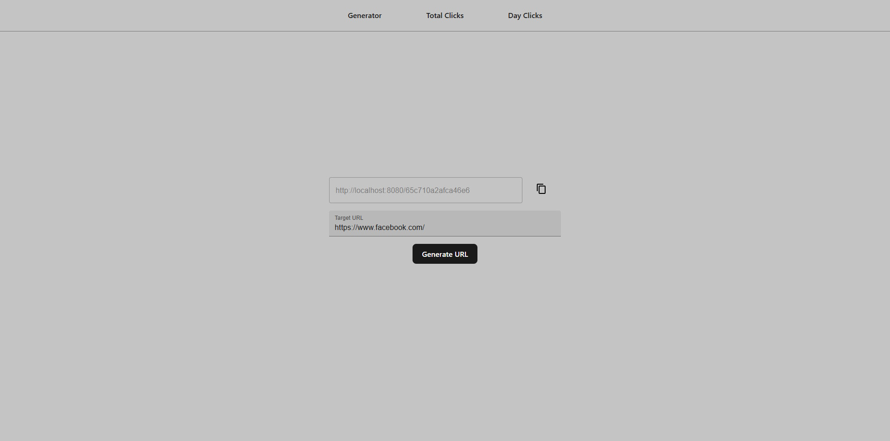
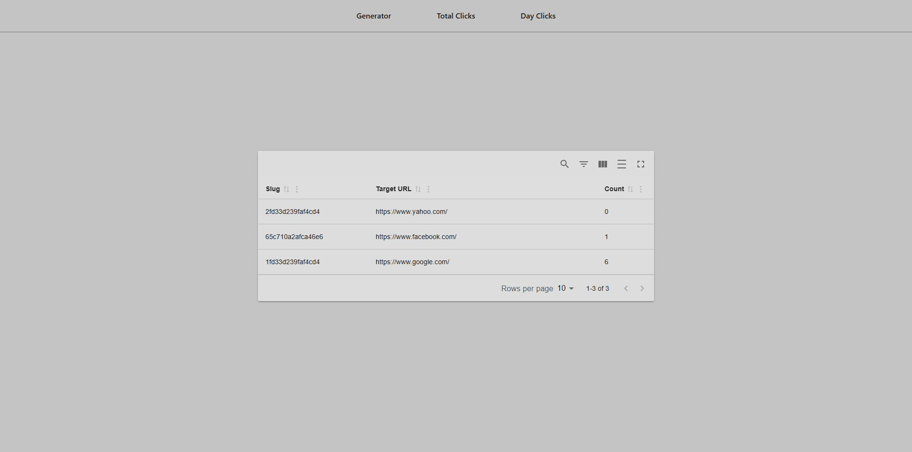
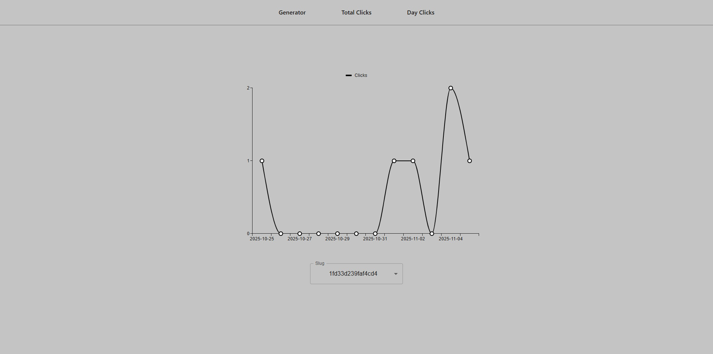

# url-shortener-ui

> A React SPA that generates short URLs with unique slugs and provides two data charts: 
> a table of total clicks per slug and a line graph of total clicks per day







## How to Run

### External Dependencies

You will need the following installed to build and run this app locally.

- [Docker](https://hub.docker.com/welcome)

### Local Setup

- Start the backend: [url-shortener-api](https://github.com/clang27/url-shortener-api)
- Run `docker compose up` to build and install Vite app in a container with a Node 22 Docker image
    - This will also host a Web Server on port 5173

## How To Use

- Go to [http://localhost:5173](http://localhost:5173)

## Notes

### Trade Offs

> I used Vite to spin up the project. This is great for developing and building React applications, but 
> not recommended for hosting a production application. I would want to use a production-grade 
> web server such as Nginx to host the application.
> 
> I used Axios for HTTP requests. The downside, it is another dependency, but it will allow 
> this project to scale towards better data handling and error responses.

### Assumptions

- Aggregating "Clicks Per Day" implies that we should display days that had 0 clicks 
and show the earliest date that had a click and the latest date that had a click

### "Next Steps" If Given More time

- [Vitest](https://vitest.dev/) Unit Testing
- More DRY principles
  - i.e. Feedback component props
  - Breakdown components into more modular pieces for re-usability
- Styling and theme framework
- Better URL input field validation and sanitation
- Data caching with a custom React hook

### AI Usage

The following GPT-5 LLM prompts were used to assist in development:

- *"How to copy text to clipboard with TypeScript?"*
```ts
const copy = useCallback(async (text: string) => {
    try {
        await navigator.clipboard.writeText(text);
    } catch (err) { }
}, []);
```
- *"How do I prevent data from expanding columns with MaterialReactTable?"*
- *"What are some ways to get a TypeScript Date object that is one day ahead of another Date object?"*
```ts
const nextDay: Date = new Date(currentDay.toString());
nextDay.setDate(currentDay.getDate() + 1);
```
- *"Show me a quick example on how to make a REST API call using Axios."*
